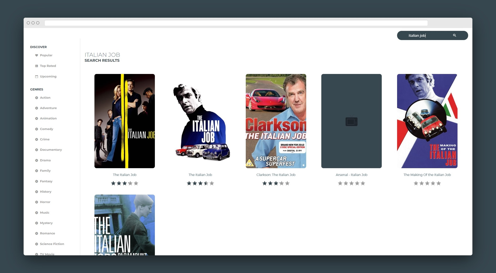
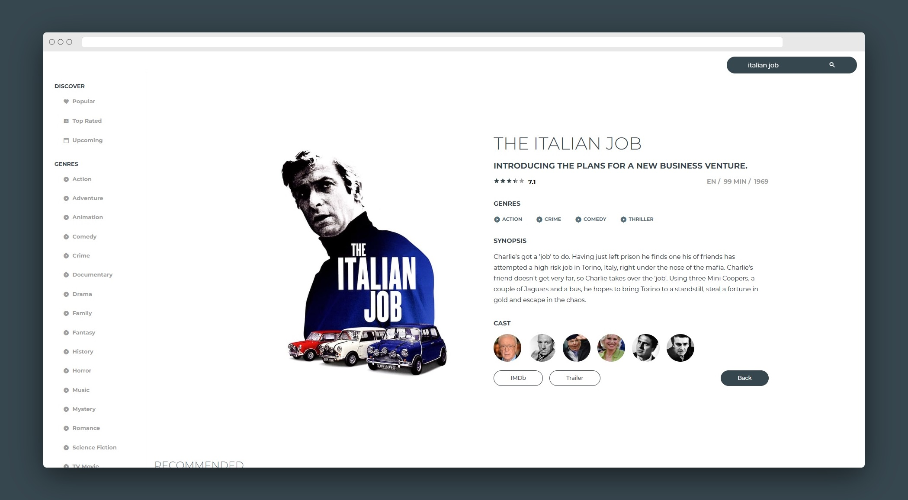

# Movie Browser React

## [Check live demo!](https://mbr-mf.netlify.com/)

This React application uses the TMDb API to list movies depending on search terms and also contains different genres and pre created options to browse through movies. 

## How to Use

Use the search bar to type in a movie name then hit Enter or click the search icon to submit your request. The app returns data depending on your input. You can click on the listed movie to see a detailed page and play a trailer or visit the movie's website. You can also click on the movies' casts to check a specific person's biography and other plays.

## Built With

- React JS
- React Router
- TMDb API
- SCSS
- Material UI for icons and navbar